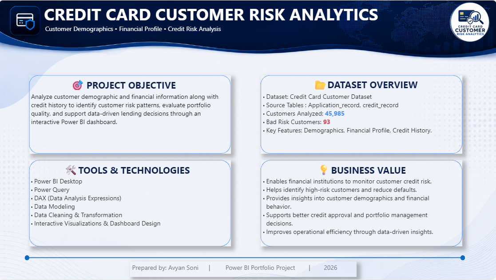

*Credit Card Customer Risk Analytics Dashboard

# Project Overview
This project is an interactive Power BI dashboard developed to analyze customer demographics, financial profiles, and credit history. The dashboard helps identify customer risk patterns, evaluate portfolio quality, and support data-driven lending decisions.

# Project Objectives
- Analyze customer demographic and financial information.
- Identify high-risk customers using credit history.
- Monitor portfolio quality using KPIs.
- Enable interactive analysis through filters and slicers.
- Support business decision-making with actionable insights.

# Dataset Information
Dataset: Credit Card Customer Dataset
Source Tables:
- application_record
- credit_record
Customers Analyzed: 45,985
Bad Risk Customers: 93

Key Features:
- Gender
- Education
- Income Type
- Occupation
- Family Status
- Home Ownership
- Car Ownership
- Credit Status

# Tools & Technologies
- Power BI Desktop
- Power Query
- DAX
- Data Modeling
- Data Cleaning
- Data Visualization

# Key Performance Indicators
- Total Customers
- Good Customers
- Bad Customers
- Risk Rate
- Average Income

# Dashboard Preview

## Dashboard

### Key Business Insights

### Project Overview

## Dashboard Features
- Interactive slicers and filters
- Dynamic KPI cards
- Customer demographic analysis
- Financial profile analysis
- Credit risk analysis
- Business recommendations
- Executive dashboard design

## Business Value
This dashboard enables financial institutions to:
- Identify high-risk customers.
- Monitor customer credit portfolio quality.
- Analyze demographic and financial trends.
- Support informed lending decisions.
- Improve customer segmentation and portfolio monitoring.

## Skills Demonstrated
- Power BI
- Power Query
- DAX
- Data Modeling
- Data Cleaning
- Dashboard Design
- Data Visualization
- Business Intelligence
- KPI Development

## Author
Avyan Soni
Aspiring Data Analyst
